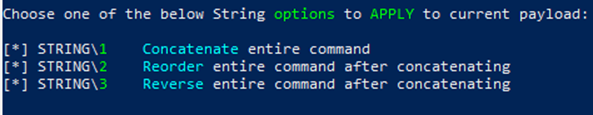

# May-FlowerShell

## Scenario**:**

Take the following code and find the flag. (This code will not harm your pc)

Tip - I would create a Windows VM with Defender Turned off as some of these challenges will get flagged for their behavior.

## Challenge creation

\-          All levels were created with invoke-obfuscation

\-          [https://github.com/danielbohannon/Invoke-Obfuscation](https://github.com/danielbohannon/Invoke-Obfuscation)

\-          This tool can be used by APTs as a way to bypass av/detection

\-          Being able to reverse engineer these in some way to understand what is being done is critical to DCO

.png>)



.png>)

.png>)

.png>)

## Key Take Away For This Scenario:

* All of these were created by a tool called **invoke-obfuscation**
* This tool takes valid PowerShell code blocks and allows the write to obfuscate this in any number of ways in a matter of under a minute.
* These are being used by script kiddies to APTs today in order to evade detection
* Only some of these obfuscation techniques are captured by AV based on their behavior alone
* As a Hunter/Defender we have one tool that they cannot hide from us at.

### **PowerShell Script Block Logging and Module Logging**

* In order to enable this, edit the **Local Group Policy** for Computer and Users @ **Administrative Templates -> Windows Components -> Windows PowerShell**
* **Enable Script Block Logging** and under **Module Logging set the modules to \*** to get every module that gets called.
* With these 4 settings all the PowerShell that runs on a box should show up.
* Make sure you run **gpupdate /force** to implement these settings after setting.
* All logs should be in the event viewer under **Application and Service Logs -> Microsoft -> Windows -> PowerShell -> Operational**

## The Questions:

This is to show how easy it is to solves these with the de-obfuscation done as the code is ran.

**\*\*\*if you do this with live malware make sure your sandboxed and isolated\*\*\***

### **Level 1:**

```
inVOKe-ExPRessION ( ('xiz'+'turkey=3UN'+'f'+'ivect'+'f{tur'+'keys_'+'g'+'o_gob'+'b'+'le_'+'gobble}3UN').REpLACE(([ChAr]120+[ChAr]105+[ChAr]122),[StRiNG][ChAr]36).REpLACE(([ChAr]51+[ChAr]85+[ChAr]78),[StRiNG][ChAr]34))
```

.png>)

We see this in the 4103 event

```
CommandInvocation(Invoke-Expression): "Invoke-Expression"
ParameterBinding(Invoke-Expression): name="Command"; value="$turkey="fivectf{turkeys_go_gobble_gobble}""
```


**fivectf{turkeys\_go\_gobble\_gobble}**


#### Endcoded Message:


```
$turkey="fivectf{turkeys_go_gobble_gobble}"
```


#### Obfuscation Technique:

String Concatenate x1

### Level 2:

```
(("{7}{8}{5}{0}{6}{2}{3}{10}{1}{4}{11}{9}"-f'6nf','_g','v','ectf{l','et_ba','te=5','i','h5Gb','as','ted}56n','ets','s')).rePLAce('h5G','$').rePLAce(([ChAR]53+[ChAR]54+[ChAR]110),[STrING][ChAR]34)| &((geT-VARiAbLe '*mDR*').naME[3,11,2]-JOIn'')
```

This obfuscation created 6 events:

.png>)

The 4104 Shows the de-obfuscated code:


$baste="fivectf{lets\_get\_basted}"

**fivectf{lets\_get\_basted}**


#### Endcoded Message:


$baste="fivectf{lets\_get\_basted}"


#### Obfuscation Technique:

Reorder x1                    ****                   &#x20;

### **Level 3:**           &#x20;

```
&( $env:cOMSpec[4,24,25]-JOiN'') ( ([RuNtimE.InTeropsERvICEs.MArsHaL]::PTrtostRiNGauto([rUNtimE.INtEROPSERViCes.marShaL]::SeCUrEstRiNGTOBSTr( $('76492d1116743f0423413b16050a5345MgB8AFcAZgArAGkATgBMAGYAdAB2AFUAdQBWAFQANAAxAEwANgByAFoARwB6AHcAPQA9AHwAYgBiAGMAMgBlADYAYwAyADIAYgA0ADYAYwA4ADcAMQAzADUANQA5ADkAMAA4ADgAZQA3ADgAOAAxAGEAYQA1ADYAMABiADEAMwAwAGIAYwAyAGQAYQAxADQAZQA4ADMAMQAxADUAYwA1ADUAOQA1AGEAOQBmADgANwA1AGMAZgA5ADYAMwA5ADAAOQA3ADEAZABlAGMAZAAyADMAYwAxADEAYQBhAGUAMAA3ADIAOABmAGMAZABkAGIAMABiAGEANgA4ADEANwBhADQANABiAGEAMQAwAGYAMgBiAGUAZQA0AGQANwBlADQAYQAxADQAMgBiADEANQAxAGQAOQA2ADMAMQA1ADgANgBkAGIAZAA5AGQANQAyADUAZgA1ADAANgAyADMANQA1AGEAYgBmADUAMAA1ADEAOAA0AGQAMwBkAGIAMABkADQAOQA0ADUAMwA0AGMAZQBlAGUAMAAzAGIANgBiAGIAYQBjADcANwAwADkAMQBlADQAZQBkAGQANgBjADAANgBjAGEANAA2ADUAYQA0ADIAZAA5ADcAZQA2ADcAYwAxADkANwA5ADkANABmAGUAYgAwADUANgAyADAAMgA3ADAANgBmADIAYgAxADgAYgBmADMAZAA0ADMAYgBiADEAZgBiADgAOQA3AGEAZQBjAGMAYwA2ADAAYQA=' | ConVerttO-secUReStRIng -K 105,96,78,5,118,178,158,144,131,126,145,80,44,50,161,3)) )) )
```

### **Level 4:** &#x20;

```
${+ }=  +  $(  );${=$%}  =${+ };${!=%}=++  ${+ }  ;  ${-}  =(  ${+ }=  ${+ }  +  ${!=%}  );  ${!}  =(${+ }  =${+ }+  ${!=%}  );${/@+}=  (${+ }  =  ${+ }+  ${!=%})  ;${;.(}=  (  ${+ }=${+ }+${!=%}  )  ;  ${;}  =(${+ }  =${+ }  +${!=%}  );${=*}=(  ${+ }  =  ${+ }  +${!=%}  )  ;  ${$}  =(${+ }=  ${+ }+  ${!=%});${[%-}=(  ${+ }  =  ${+ }  +  ${!=%})  ;${([!}  =  "["  +"$(  @{}  )"[${=*}  ]  +  "$(@{})"["${!=%}${[%-}"  ]  +  "$(  @{  })"[  "${-}${=$%}"]  +  "$?"[${!=%}]  +"]"  ;  ${+ }=  "".("$(@{  }  )"["${!=%}${/@+}"]+  "$(  @{  })  "[  "${!=%}${;}"  ]  +"$(@{}  )"[${=$%}  ]  +"$(@{})"[  ${/@+}]  +  "$?  "[  ${!=%}  ]  +"$(@{  })"[${!}  ])  ;  ${+ }="$(  @{  }  )"["${!=%}"  +  "${/@+}"  ]+  "$(  @{}  )"[${/@+}]+  "${+ }"["${-}"+  "${=*}"  ]  ;"${([!}${!}${;}+  ${([!}${!=%}${!=%}${;.(}+${([!}${!=%}${!=%}${;}+  ${([!}${!=%}${!=%}${=*}  +${([!}${!=%}${=$%}${-}+${([!}${!=%}${=$%}${-}+  ${([!}${!=%}${=$%}${!=%}+${([!}${!=%}${=$%}${=$%}  +  ${([!}${;}${!=%}+${([!}${!}${/@+}  +${([!}${!=%}${=$%}${-}  +  ${([!}${!=%}${=$%}${;.(}  +  ${([!}${!=%}${!=%}${$}+${([!}${!=%}${=$%}${!=%}+  ${([!}${[%-}${[%-}+${([!}${!=%}${!=%}${;}+${([!}${!=%}${=$%}${-}  +  ${([!}${!=%}${-}${!}+${([!}${!=%}${=$%}${;.(}  +${([!}${!=%}${=$%}${[%-}+${([!}${[%-}${;.(}  +${([!}${!=%}${!=%}${;.(}  +${([!}${!=%}${!=%}${;}  +${([!}${!=%}${!=%}${=*}  +${([!}${!=%}${=$%}${-}+  ${([!}${!=%}${=$%}${-}+  ${([!}${!=%}${=$%}${!=%}  +${([!}${!=%}${=$%}${=$%}+  ${([!}${!=%}${-}${;.(}  +  ${([!}${!}${/@+}  +${([!}${;.(}${[%-}  +  ${([!}${!=%}${!=%}${/@+}+${([!}${!=%}${=$%}${!=%}  +  ${([!}${!=%}${=$%}${[%-}  +  ${([!}${!=%}${!=%}${!=%}+${([!}${!=%}${!=%}${$}  +${([!}${!=%}${=$%}${!=%}  +${([!}${/@+}${;.(}+${([!}${!=%}${!=%}${$}+  ${([!}${[%-}${=*}+${([!}${!=%}${!=%}${/@+}  +${([!}${!=%}${=$%}${;.(}+${([!}${[%-}${=*}+  ${([!}${[%-}${$}+  ${([!}${!=%}${=$%}${$}  +  ${([!}${!=%}${=$%}${!=%}  +${([!}${!}${-}  +${([!}${!=%}${!=%}${;.(}+  ${([!}${!=%}${!=%}${;}+${([!}${!=%}${!=%}${=*}  +  ${([!}${!=%}${=$%}${-}  +  ${([!}${!=%}${=$%}${-}+  ${([!}${!=%}${=$%}${!=%}  +${([!}${!=%}${=$%}${=$%}  |${+ }"  |.${+ }
```

### **Level 5:**&#x20;

```
c:\wInDOws\sYsTeM32\cMD.exe  /c pOwErShelL -nOniNTErAct   "(((\"{106}{71}{112}{109}{60}{39}{38}{15}{7}{30}{75}{27}{3}{63}{20}{58}{104}{107}{25}{35}{16}{11}{24}{92}{45}{31}{108}{14}{64}{115}{94}{65}{37}{116}{55}{66}{59}{69}{56}{88}{96}{89}{46}{50}{42}{98}{102}{51}{8}{110}{57}{74}{103}{47}{44}{99}{68}{34}{21}{114}{91}{19}{85}{33}{72}{113}{28}{32}{70}{48}{17}{2}{95}{101}{26}{22}{29}{10}{84}{90}{9}{0}{62}{49}{81}{105}{73}{53}{52}{100}{1}{4}{41}{61}{78}{54}{83}{43}{86}{80}{77}{5}{6}{111}{76}{97}{13}{82}{87}{36}{79}{12}{18}{40}{93}{67}{23}\"-f'eT-It','9','vncY','[]gNI','E)o0L + ',' ( ','8x','2,51,4[cepsmOc:VNe8xG ','9E','(s','0','cal','Ariabl',')','s[,','9ENIOj-]5','e','a','e:of','+Y9E{ftceY9','[','9E','x',' Y9E ) o0L ) ','PEr.','aHC[+57]raH','E','C','9','(o','( &DkT)4',']','E+Y9E','Ev','_rY9E+Y','C[((','9E','.)','Y',')Y9E','SY','[','v-evomer;Y','UPX8b3[ ','E+Y9Eelp','raHC[','EbaY9','_Y9','Ep','v','E+Y9Eira','Y','9E Y','Y','] ( 8','Eel','9ElY','+Y9Eei',',)15]','Y9E','o0L ','STRiN','Em Y9E','rts','Y9EvncY9E(','r','ppa e','E  Y9E','+Y9Et','+Y','lpY9E+Y9','G','Y9E+Y9Eif3','S','p_ym_','3]raH','PX8b3.','-','g','V','.. ','ARiaBLe',' ])+o0L 8xG( seT','xG','L ','E+Y9','- 1','-iTEm Y','9E+','9','8xG','oyY9E',')63]','9','E','9E( o','Y','LEnGTH','9E+Y','pa_ehY9E','9EY','0L; i','9E3T','fo','raH',':of','8x','C[+48]r','gNIrt','B3=','+Y9EK}Y9E','GU','UpX8','TK=eY','u','ecalP','Y9'))  -cREPlaCe([CHAr]56+[CHAr]120+[CHAr]71),[CHAr]36  -cREPlaCe ([CHAr]89+[CHAr]57+[CHAr]69),[CHAr]39 -cREPlaCe([CHAr]111+[CHAr]48+[CHAr]76),[CHAr]34  -replACE  'DkT',[CHAr]124) |.( $enV:ComSpEC[4,24,25]-joiN'')"
```

### **Level 6:**

```
cMD.EXe /c   " EchO $T6DZIp = ")''nIoj-'x'+]3,1[)(GNIrtSoT.ECNerEferPEsObrEv$ (^& ^|)93]RAhC[,)511]RAhC[+09]RAhC[+611]RAhC[( ecAlPEr-  63]RAhC[,)09]RAhC[+37]RAhC[+25]RAhC[(EcaLpErC-  421]RAhC[,'IOd'  EcaLpErC-  )' ) )43]r'+'aHc[]gNIRTS[,sZtFEksZt(EcalPeR.)93]raH'+'c[]gNIRTS[,sZtOuhsZt(EcalPeR.)sZtIOdsZt,sZt7qQsZt(EcalPeR.)sZtZI4sZt,sZt3cPsZt(EcalPeR.)sZt)OuhxOsZt+sZtuh+]31[dIlsZt+sZtlEhsZt+sZts3cs'+'Zt+sZtP+]sZt+sZt1[dsZt+sZtisZt+sZtLlesZt+sZths3cP sZt+s'+'Zt( ^& sZt+sZt7qQ OuhOuhNisZt+sZtOsZt+sZtJ-sZt+sZt sZt+sZt] )s'+'Zt+sZtH'+'sZt+sZtTGNEsZt+sZtlsZt+sZt.eULav.))FEsZt+sZtksZt+sZtRsZt+sZt3FEk+FE'+'s'+'Zt+sZtk6MsZt+sZtFEk(  EsZt+sZtLbAIRAv-TsZt+sZteg  sZt+sZt( sZt+sZt(-sZt+sZt sZt+sZt..sZt+sZt1sZt+sZt- [eULav.))sZt+sZtFEkR3FEksZt+sZt+FEk6MsZt+sZtFEksZt+sZt(  ELbsZt+sZtAsZt+sZtIRsZt+sZtAvsZt+sZt-TesZt+sZtg  sZt+sZt(sZt+sZt; FEsZt+sZtk sZt+sZt.sZt+sZt sZt+sZt( sZt+sZt3cPSsZt+sZthsZt+sZtelLsZt+sZtIDsZt+sZt[1sZt+sZt]'+'+3csZt+sZtPsHsZt+sZtElsZt'+'+sZtLid[sZt+sZt13]+OuhXOsZt+sZtuh) (sZt+sZt ((sZt+sZ'+'tOuhVAOsZt+sZtuhsZt+sZt+OuhNOuh+OsZt+sZtuhjOuhsZt+sZt+OuhersZt+sZtksZt+sZtysZt+sZt=qPKfiv'+'Ouh+OuhectsZt+sZtf{sZt'+'+sZtOsZt+sZtuhsZt+sZt+s'+'Zt+sZtOuhsZt+sZtdOuhsZt+sZt+'+'sZt'+'+sZtOusZt+sZthsZt+sZtoOuhs'+'Zt+sZt+sZt+sZtOsZt+sZtuhnt_besZt'+'+sZt_OsZt+sZtuhsZt+sZt+OusZt+sZthjerksZt+sZ'+'ty_esZt+sZtat_sOusZt+sZth+O'+'uhomOuh+OsZt+sZtuhe_turO'+'uh+OuhsZt+sZtkey}OsZt+sZ'+'tusZt+s'+'Zth+OuhsZt+sZtqsZt+sZtOuh+OusZt+sZthP'+'Ouh+OuhsZt+sZtKOuh+OuhsZt+sZt;rOuh+sZt+s'+'Zt'+'O'+'uh'+'emove-sZt+sZtvsZ'+'t+sZtarOusZt+sZth+sZt+'+'sZtOsZ'+'t+sZtuhiaOuh+sZt+sZtOuhblsZt+sZteOuh+Ouh OsZt+sZtuh+OuhjOuh+sZt+sZtOuhesZt+sZtrkyOusZt+sZthsZt+sZt)sZt+sZt-sZt+sZtcsZt+sZtRePsZt+sZtLaCsZt'+'+sZte([chAR]113+[chsZt+sZtARsZt+sZt]80'+'+[csZt+sZthAR]75),sZt+sZt[chsZt+sZtAR]sZt+sZt34sZt+sZt sZt+sZt -REPlasZt+sZtcsZt+sZte OuhsZt+sZtVANOuh,sZt+sZt[chAR]3sZt+sZt6) sZt+sZt) FEsZt+sZtk =sZt+sZt  r36MsZt+sZt3cP;krej3sZt+sZtcPsZt+sZt; ) sZt+sZt)4'+'3]rsZt+sZtAsZ'+'t+sZthsZt+sZtc[]gsZt+sZtNIsZt+s'+'ZtRtssZt+sZt[,)9sZt+sZt7sZt+sZt]rAhc[+79]sZt+sZtrsZt+'+'sZtAhc'+'[+sZt+sZt1sZt+'+'sZt1sZt+sZt1]rAhc[((sZt+sZtecAlsZt+sZtPER.))OuhsZt+sZtusZt+sZtOuh,sZt+sZtOuhsZt+sZt'+'_ebO'+'usZt+sZ'+'th,Ouht'+'Ouh,OsZt+sZtuh{sZt+sZtgalOsZt+sZtusZt+sZth,Ouh_tasZt+sZte_yksZt+sZtreOuhsZt+sZt,OuhsZt+sZthOuh,OuhOasZt+sZto}yesZt+sZtksZt+sZtrOsZt+sZtusZt+sZth,Ouh_emosOuhsZt+s'+'Zt,OusZt+sZthjOuh,sZt+sZtOuhsZt+sZtfOsZt+sZtao tsoOuh,OsZt+sZtuhsZt+sZt-etisZt+sZtr'+'sZt+sZtwsZt+sZtOuh f-sZt+sZt'+' FEk}4{sZt+sZt}01sZt+sZt{sZt+sZt}8sZt+sZt{}3{}sZt+sZt6{sZt+sZt}2{sZt+sZt}9sZt+sZt{}7sZt+sZt{sZ'+'t+sZt}1sZt+sZt{sZt+sZt}5{}sZt+sZt0{FEk((( )OsZt+sZtuh'+'OuhNIoJ-]2,1sZt+sZt1,3[emasZt+sZtnsZt+sZt.)OusZt+sZth*sZt+sZtRdsZt+sZtm*Ouh ElsZt+sZtBa'+'iRsZt+sZtav-sZt+sZttEG(( .=ksZt+sZtresZt+sZtj3cPsZt(()sZtsZtniOJ-sZtxsZt+]3,1[)EcnErEFERpEsoBreVZI4]gNIrTs[( (^& '(("; [sTRiNG]::JoiN('' ,(  IteM vARIABLe:T6dZip ).vAluE[ - 1.. -((  IteM vARIABLe:T6dZip ).vAluE.LENGTh )] )^^^|iex  |  poWeRsHEll  $EXEcUtIoNCONtExT.InvOKEComMAnd.inVOkEsCrIpt(  $iNPUT )"
```

### **Level 7:**

```
CMd  /c"sET   gVX=-JOiN ( (119 ,121, 119 , 127 , 119, 115 , 50 , 25 , 1,109,52,24 ,58, 36,7,18,52,12,99 , 123 , 101, 99,123, 101 , 98 , 10,122 ,61 ,56 ,30 , 57 , 112 ,112 , 126, 119 ,127 ,119 , 12, 4,3, 37 ,30,25 ,16, 10, 109 ,109,29 ,56, 62 ,25 ,127 , 119, 112 , 112 , 123, 127, 112,102 , 99,2 ,111 ,30 ,101, 3,110 , 102 ,19 ,102,110 ,14,110,100, 118 ,110 , 102 ,39,102 , 96 , 14 , 110,100 ,14,110 , 102,45, 102 , 97,47,110 , 100, 2, 110 ,102 , 2,102 , 111 ,118 ,110,100, 47, 101, 47 , 103 , 14,102 ,100,118,96,103,14,103 ,19, 96, 3 , 96 , 100,39, 97 , 98, 3 ,97, 97,39, 96 ,39, 102,101,2 , 96, 118 , 97,110,19 ,111 ,99, 8,102 ,100 , 45, 102,102 ,111 , 47 ,97 ,98, 30, 111 ,101 , 118,96 ,45, 102, 101 ,47 , 96 ,14,96,97,14 ,97 , 110, 19 , 96 ,47,102, 101 ,39 , 96,14,102 , 102,98 , 118 , 96,8, 110, 39,103 , 14,102 , 100, 19,102 , 102,103,19,97, 98 ,8 ,96 ,96, 2, 97, 110,47, 103 ,118,111, 14, 101,19 ,110,102 , 3 , 102 ,97 , 8, 110, 100 ,39 ,110,102,2 ,102,96 , 19 ,110 ,100,47 ,101 , 45 , 102 ,100,19 ,96, 103 ,19,96 ,8,97, 97, 8,97 , 98 , 30 ,111 , 100 ,19 , 111, 99,39 , 96 , 3 ,102, 101 , 3 ,96 , 118 ,97 , 110 ,39 ,96,3,110, 2, 103,45 ,102 , 100 ,118 , 102 , 102 ,111,8 , 97 , 98 , 30,96, 97,39,111,98 , 118 , 97, 110,8,103 ,14 , 111 , 30 , 101 ,3,96 ,103, 30 ,96,100, 3 ,111,97 , 19 ,97, 110, 30,97, 96,8 ,111,99,45,96,103, 2 , 110,102, 19,96 ,100, 47,96 , 96, 45,102 ,101 ,96, 19 ,97, 98 , 8,96, 97, 30,96 , 97 , 19 ,102, 101,96, 118,97, 98,8 ,97,97 ,39, 111, 98 ,39,111 , 99 ,8 , 102,101,96,8 , 111 ,99, 2,96 , 101, 2 ,97,98,47 , 111,99, 47 , 102, 101, 96 ,118 , 97 , 97,118,97 ,98,45, 111 , 100, 45 , 111 , 99,14 , 97 ,110 , 47 , 110,100,2, 101,39, 110,30 ,101, 96, 118, 102, 99,14, 111,19 , 101 ,19, 110,102 ,47 ,102 , 97 , 45 , 110,100 , 2,110,102, 3, 102, 111,19, 110 ,100 ,39 ,110 , 102 , 118 ,102 ,110, 30,110 ,100,3 ,110 ,102, 39,102 ,96 , 14,110, 100,47 , 101,8,102 , 100 , 8,96,103,47, 96, 47 , 111,101 ,14, 97, 110 ,19, 96 ,96 ,47, 96,110,39,111, 97,14 , 96 ,8 ,102 ,101, 47, 96 ,45 , 97 , 97, 3, 96 ,97, 2 , 97 , 110, 30 , 96,47 ,102, 101, 8,96 ,19 , 97, 110 , 14,102,100 , 3 ,111, 97, 8 , 96,8,102, 101 , 47,96 , 2 , 97, 98, 39 ,111,101, 45 , 96 , 100, 30,97, 98, 19 , 96 ,14, 110,39, 103, 19 ,111, 118, 101 , 19 , 110 , 102, 14 ,102 , 96,30,110, 100, 3,110, 102 ,118, 102,97, 47 , 110 ,100,8,101 , 47 , 102 ,100 ,118 , 96 , 103 ,8 ,96, 2 , 97 , 110,45,96, 118,102, 101,47,96 ,47,97 , 97, 118 , 97, 98,30 , 111,100, 118,111 ,99 , 14,96 ,2, 110, 112 ,121,4 ,39 ,27, 30,3,127, 119,112 ,47, 14 ,118, 3,30 , 2 , 19, 45, 8, 39 , 112, 126 ,119, 43 ,119, 114 ,44,119, 12 , 52,63, 22, 5,10 , 119 ,127,119,115 , 8 ,122 , 21,15,56 , 37,119 , 119, 103 ,47,101 , 103, 119 ,119,126 , 42 , 126, 119 ,126, 126, 119 )^|FOreach {[ChAr] ($_-BxoR '0x57' )} ) ^|. ((GET-VARiaBLE '*mdR*').name[3,11,2]-JOiN'')&&mShta   VBSCripT:CrEateOBjecT("WSC"+"RI"+"pT.Shell").RuN("PoWeRShEll   (  ^&  (  'Ls' ) ('{0}{1}'-f'eNv:G','VX' ) ).'VaLUE'   ^|   . ( '{3}{1}{2}{4}{0}' -f 'N','-ExP','Re','INVoKE','sSIO' )",1,TRUe)(WindoW.ClosE)"
```

### **Level 8:**           &#x20;

```
c:\WiNDOws\SYsTEm32\CMD   /c "sET   fzS=(New-OBjEct io.compRession.dEflATESTrEAm( [SySTeM.iO.memoRYSTrEam][coNVeRT]::FRoMbase64sTrING( 'bVdrc9rIEv0r82E3SBFySQi9krofiCMbXDa2wQW5q1Jtyax4JGC8Aru8Yfnvt8/MtIa4bpXl6enpx5me1ujwwRK/Pe/6202Wdwvnt7txf3tT5QHJrbeWbQnLallW5+fw4B8PLaflp8dDHB8PHfojjU+j7x0P3eR4CGke0BPTk0bHQ9KlNZ8E+ZBPSE8Kg0SGSkKKERwPUQo7/JMz6UVL3RihSd1Nj2R9iChVgAgxzSg6gioIlD8N4YVVAKMQKYUKEKoDN7KNySKSVoBHKwFNAix6amPw6mI7PvZCT0whYsQmDBFFSLFP0oVIQakSGhNaC0nXBRCPnNIEEeBJHiHyeT7wYge+F2COvORJGpghCAULsH9AJDkGbqyRjnKGFCmiqSwTmaNs2BA50mqQyHL45INCJMjv4YBI6AIxgnn0T9aLlBGUOB6CHAE26egvwC5kfWi9I+sgywc3DyhkekxIQyuhXJUbJOOIInTIQioIEOoTetg1tY5w5z8uHvC06dno0R3ssxsh5vfTV625n2phft9ohJZ2lRb2t9cVh7LF5mKi5YuJaGtxVT5eV5+2F7smzvDSsrVYN6GrOcGDBQ3QPOiVybwBMlwUOftllw26KVCLJnGwmlt68n2oBYrZ0+JIj59uoNyf97OxRbgZ0Ki31BJnbVP0enDZZ0BTxyA6mhJRNCVnozPbYDuBtr7TAuFi3XCgha7nF5R7lltWNSs5td3p4GXQ04qrpbxlRoCp2d4WJjEWxCPZCD3hI5vaP/1lyoZ6dKgEItCTD1w/PrDF06p+GN++K4w5O/sUF6XEOTSn7S8tUb2sy4krEdPDRzJ9m5uykeCcdNqYkTHszUwLs+psT8bb8b7m4lHfnrYop8guTPj7qbVRyDB7M0fIYblzCYSxGzydnGSTAtXsfNNlDbn23O5qEyrG8xV7Td09GctNmh4vTLetGZFEPM6424qm67SAMIKTTbfzHWfo6JGbwRGWyHfc7Xrcfqmr18Ak4ir8rsdvP7XQ/4s1egwYySwvLhsRG+JWZlDmFrjLOP9UlXVa6qoZBBOt6ZT/cKBf+wynOXWvuPsemyah91yY8FrK/XZQMCRxEHQb/MlWm8Z1f1bNnrizYDOpzKHnTto9ORm8P2ccfugKdvtyO87u+B1wiqDt5za/OA+j5r3+8eu1cz99Gmy1/L3ZiLA+8IGP9ju+5K7c+f+5hPVYXWR1xoucFn1on42y53U5yyzVt1jLd/vRYHhZ5LNlWRdBamws2rfS0tfdUVLsaSGJ7Peu3V/CU+V06nH/BclNXB2hiw7hBBEnSGz49K5QY1vQKMjsAzWsJdM9XdK0oJCTrEaZn0fZRVVXw1llN+eLvnSvtit0C6K0bPd8VN1dI3l+3u9R7sBRQtzRAnES2pAUg0g09i0C0NJ6Ih5GT19L1gdGLdAojT61hS0+S15mvcx68gsPXoKvveRgniIIHcWbQlAtRXUSzc4kDVAsylN0DGwqCRT9oAViINI1VLwlVNwCDAyEyFe8BN98UDowA3ChWNGUJFREAfyqo4gJeBeoW1fxHVAH0A2QBZBESc26iu+AeRDhk5QN/A1MBUwQTCXU3A5kE1SF+aOneahimqBLgaZv4HOJYqVgmaCLkqlhi4rHgryFniJ44GAgLqkiRSBCYHGgYsGRKk08RkRv5Ltz6miRRm+7Nj0/9FjrsXqjf7huabjRukiPudOJzao3rKN3zreDoRi/Tq71lHNM/1ACcruVifAVG1lxkoUWhE3w7BuOuX0dGo/r+xetBvl5adIv3iGtq0kT1tHS4n2iaGFpKShqhQ4T97vWLs+1UOqxK0eyI9V/i09a27bj2NSBo8CME3V4Z7yn9eYPVk1Xlyaq4EKfL8tRLsy+q3pXWVRZ9srLkRZfJ+u/X9JM/Id9x3pckWtNJGJfcVanQbkoRbXhXaEbHuWEPPTyxOVMeixEQUiFbes5XetrjmtLP954U+8Zx1iZfTw2pc215J2gGNNDt8LwdjVGtGz0/K1SmGAx5HOEaX+9e6PBqRvlu1N2TFN85j3U5VKLvmnITwZdtJiWJ0fIBeqvm0YXnxmPPK/z3MrOSSqv7wCUz4StK3HPb0IlTIGXJxCbIhK4RtLC/om7JHcSz2cI1QsbmC2iU23bndHXhG7cij4LM8q17I2KJMY3hAT65aal2KdLXUpBV4jGSW1cN5lej0xIbOD+a6wX8VtghMu/CUAaxGBQOgBpU/vhOqZvlXU5QYyPN3+NPgLu2bDc0E/1tu+3O4X7fTsgW5yx7Ch8nBD1PBMCNWvJgPh8uHV2t5ZfFbrTGjVwnHhQRl4ijPa/Mn21dye90aD35boSrY+br/XHln321NtkBsTtathq2Z/rarN9rdzXsqYfY+tKlO3H/wE=' ) ,[SysteM.IO.comPreSSIOn.comPResSioNMoDe]::DecOMPRESS)^|fOReaCh-objECT {New-OBjEct iO.stREAMreAdeR($_ ,[sYStem.text.eNcODinG]::AsCIi)} ).ReadtOEND( )^|^&((gV '*mdr*').nAME[3,11,2]-joiN'')&&C:\wIndOwS\SysTEm32\rUndlL32  SHELL32.DLL ShellExec_RunDLL   "C:\wInDoWs\sySWow64\WIndowSPowershELL\v1.0\POwersheLL.eXe"   "-nOpRo  "   "-WI HiDdeN"     "${eXECUTIoncONTeXt}.'inVokecOMManD'.(  '{2}{1}{0}{3}' -f 'ScR','VOke','iN','Ipt' ).Invoke(  (^&  (  'Gi') ('{1}{0}'-f'Zs','enV:f'  ) ).'vaLuE'    )"
```

### **Level 9:**

```
CMd.eXE/C  "sET   hLc=. ( $Env:cOmspeC[4,24,25]-JOiN'')(new-Object  SYSTem.iO.StreAMREADER( (new-Object iO.CoMprEssIon.DeFLATestREam([iO.mEMORYStReAm] [cONvERt]::fRombaSe64sTrInG('jVRtc6JIEP4rU1ZcoFSOwRk4TeUDUSIYxfAiG0NRW4SFLKxCBJI9y/O/Xw+a7NV9ug/T8/RM9zNPz9B8QTy68vXqtnT110q/0yvdinWxKeumMosZLwS4Pwx73F/cYL4yC44T+EFemgXPEcWm0onIKVaHlTJssEoZzBW8BmgAtBUZJnoCaChSygKIbFNYIIpP1DUmuMFEbjAlFSZ0TdSUEmbBSYnawDJRc6wQn9IGy4oNCSesyGtMcQM7bfAay0NGRvGJSECeYqzkEFhhSrstq9RQqWKBktwlapdin0hrSm1ghJOwAccDaxtsEOlEpZRKOZHzthg2tcU0isTqsn+X6IN0RkMUYO9iFa9bfbLqt9qhglyhZ71DyVBkH0ugTKE5HsKlSUqlSqlKGyaJBbMouDGQJeeMABsUc6L7ujAbnkvXud9UXds4ccLfqIuOiA8mhlaFMJWWrzteOB43q8zysMLzKGCvZ83Cq29C/08BCcIJzDU8tZV8Haxu53rcIGSuxLjcwaPXdVZa4vck3Wpe4nqOHi35oN7Ujb4Ts5W405crB7xKj3ZhEJfF+/m41CmXz5GrK6T2qsya8Zw0sux9HpWVF+1h1L6/sD1/+eBtHx/X69Hy8HLnzJ9ff2Trr0/Ka3n/Vijzt+jn/dN+c2+bs1ja2nfTzcvbhmpvP++Il1lKObw95Pf3Wk87TFaH7H2ebX6Zt4vF5I/NRK+e97v5i3bDCagPNR9cL2kVxysoK6lrsyzECZTonPFu9T0B3dPksuaiy13+61bcQ92cSdqCl3AZU93hr76xE9yNyzab5NETk2KymmbFDAijOjZNJKATEkQniaZeqRdTHrhF1ly69T6Oy6X7qscB6WPal2kIvZSxXrqudQ/xnWGn14kmBwxT2REQZKEgNjQnCMMO8AqjYehoRhyEMyurmjroc3u/5Hg91rYPiSMK5L/7gkrPKz1pdAH0ssL/TuMEYc/1OKDqcTc3drr3ATCnD/TPPwDMhxuAzKVzcIt4yxZ34KMU0AAGGoF5Uk9g5SMYBqQjs/g4elJ5nsUkb9vIHyAqy623i6yPbBgCjH0rYntGfTa1wrIK0hqAiXvZ+hScfAQxzW1Gi56jT8jo08HoCWb1hMEeT8PjRV4rlckTOR7xAscV2SofhFTuK3KfBJPkoV6W8fjdSq4QL3agdwLNqaINvLaj+4lTJ5CGfM3Jotttgj7eMP58w4GvIeg7dI2+sI/A/ZFsF9k0wGHvqjb07cIEfP6vCrAfuI3D+nU8zsus4BHH9f8HO/D/Aw==' ) , [SysTEM.io.cOmpresSiON.ComPrESsiOnmodE]::deCOMPREsS )) ,[SysTem.tExt.EnCODInG]::aSCii)).readtOENd( ) &&SET   Yij=c:\windoWS\SYSWOW64\windowSpOweRShell\v1.0\POWERsHeLl.ExE  -wIndo  1  -NONINTE -noPr      ${2`VA}   =   [TYPE]( \"{2}{3}{0}{1}\" -F'rO','NMEnt','e','NVi'  ) ;  ${eXeCu`TIOnC`oN`T`ExT}.\"inVo`KECOMm`AnD\".\"In`V`OkeSC`RiPT\"(    ( (  Get-VAriAble 2Va  ).VaLUe::( \"{1}{0}{2}{4}{3}{5}\"-f'nVIrOnM','gete','eNtVa','B','rIa','Le'  ).Invoke( 'Hlc',( \"{1}{2}{0}\"-f'S','PRoC','ES')  )  )  )&&  CMd.eXE/C %yij%"
```

### **Level 10:**

```
C:\WiNdows\system32\wBEM\wmIc.ExE  'PrOceSS'  "cALL" 'cREatE'  "PowErSheLl -noninT  -NoEXit -wINDoW HIDdEN  -nOpRof   "\". ((gv '*MdR*').name[3"\"+[String][ChAR]44  + "\"11"\"+[String][ChAR]44  + "\"2]-JOIn'')( NeW-objEct sYStEm.io.comprESsIoN.dEFlATesTREaM( [sYsTEm.io.MemORysTReAm] [coNvERt]::fROMBaSE64STrING('VZhXz6NYuoX/yncxR1Utd5dJJszRXJCTyZlSa4TJOWPDzPz3g7/q7ppzYQkZ2HsD+13rWe/XDzX1fuspKaXtj3m3Flb5JmrfYq0dTHa2RK37xrDcPVrY2Z5Ssv368X0OrCVtv5Xat5ZVenN/n4iU379bwWynyjda69x0Wn7/+9+5qW+paGZRZLZNUeW/fnx5uPYj6lWS1SE3swpXMR9+EoE3RnbyPgJp0SILBgsDpy5ki+t7T78QIbHfxwvMaJXa3WCpNTeXwIjxiqmrRtzgfkXtDSmQtiTQgIP7LPXdHnerXL+nmZWraZdcHhwCCu3zoeesqx8PrtE3o2KGJ/kIJ4bD6MIQe9kQWtkkiBfkqBDt0OFzOpb1sHiOVGYpqXI5dxqmqdqeDFfafXLYICE93ZMONjTwzqckwnsIW/ZsQ1tITGdXmkSmRiLJtq6dfJGt0JXodkzCmrZFlrVI86DqXCyUi0hrnAqWduHQttWoHHN7cleSXc07YTXa8bKYMbMDsI68JBLcsQ8poh4HvkTBRShffKst4fBytnvE09q29srj4VbRjTEhMCOdKauZvZyfUmd2Pt8g446NrFdtSeQmyxFLrQELQaUK7dHRq9T63s286nuO2YGdSl1D7ebFbRVc3VfxpWpa08I8tF6yYnl2gkvl9BV9RAm6auOtOBKhfBD8ogF6dBj4ImPtRCxX2PSruQBk4KYnA2Y3yV0PthuPLgSDkL652gChyvgSXDFoasokuR1Cn0j1MDg4U4QyCywtebxwR8IoAGEIWK9mtLPDBrku6spjrDCY+nLbzMfzvnn4diGdf3z5+OXj1/eO/Gs/K8OUWnPZq9/ovtXPvX0ed0qfpOdGTVi6/3H+l39//M+//rskPsr+27ycO18xUzJhp68ff/vnr99t1re/sWrcM2LHnwNEM12K55T/+fjlm8lGydKfu+7rLx///vj2cd7hpibVz6xuplw6pWrMflu0z5LIv/7yHfwV/v3y5fXlN6kXuy9ffvnfH/dYBXtvROY7+Pvl5/H7Sv/LLx9fVfZc4UNi4+VD7N/Veo49W+cTndWaNdGS/qzW/cc76M9qbc9qtZYf1Xr+/67WWFM31vysVrNvH+S7Wi17Ks9q/WK74RS9AJjVgcl6luhWG/IKT/OTkP1XVXGA8qDU7dy39w5awlUExYd4Y9fpSqChgi4LwssANNRHiCP4phH6OqV6d0UQ/bHhK/y86NgGQou4wVKDpxmPQxcIq48sgW76etkEPhNA4nqHp6TCNXjHNQG+YfodxOVpWZfLBsHhtvp+gmW+CuLZ4cNOC8+o9oox07OvWUh4AXpbm1QD104kgP5GSIAqPANQsGawmB4hvCrIrVpcUbsn9QQZyTpUimD41zXHZJt36CTDbJ5zAriO6E3ZFU+xXk9BIXocbzXQero50ROgoErIxGviUhOQVOyo6CQL9wQeLBAcTDfgI6eKgoxuyRhl8yNUCLy9oXrPQrNxXWun4LB+vgd+nfbwHe0fYz5LRJwEiInUXU5XHWrt5G44zFO780jx2N1EI2JPhWKcC1eMpYF7XqxDW7oHcsz1nUXK6AAmJrQdcVh3p0p4q9dHXOyq/H69lHjSK7zXuZXYUYY8I52Kjq5ZUWvVrrkhOdblUrbAWplGRlbIjdxct5P5yiDyXPf5qXdfLLhaA1kqOOYQ1LM3DBU3w3StMMrsVDsYaPU2WYbYdRqne43Y6UpUXlAm5h+EHxdTFJcth2Pm6kDZ6y7pceiiYpeqnmw8ukyNrEXqKn6dR0vy0KfgUXBvbZVPWsF+xcdmfsIvg96vCVMAfdMoywu4J/MagPxK5hwuxgWrlj54yWPI0PqHIy+JhsNOFrww52VOcIsq5TxJlTaJFLDHnqUvL7bUcrZy9kaM15GqNH28ybbXgwtZzv2TUpdVPtJAedr7MJnqQE1cPTN1wjeEGkxPatD0u81SF89bu5FjqDF6ha89ejKM7fmHVx6ljpsuyyJ10AP9RHGpqCP5iChevkm6Zh28gEnXsRWoi66iio+s2UIXLspugctdwI4skhfkIW1WUUQfvCrk6XLlrr9M0jWf8oO5Gzvt8dsi6hbalbPN7EFPG3lIk3foeptgKG9fJto7Mcx7F2l48gjeK1TAS3KoBveSDPMizIoqiAEDvVDPu4A7okP2HZX2dsoafCDmjzR2DKMBuBLoUL0jnBwuvPapl7If1F2HkRldxnS9UsLoWmagaaV942ZDCYIGKXx69vKwyqf9sXjStSa5cjg2MZXzFr85vTYKFSmb+y1ITpecB39Hb4GX2/K17GSrHWhuHigyQkamZCT5oSR8P8oNBVtN72vzLiG5xDI7ba7yRSuKnTTEpklYkg6aWRs0ClWaxugCN4urcqEit1w3zyKj0Bx2O7tJimrnj3D2tOW8PmbbfUAjPjBH5yJyuBomyL3Ni9PJYoBeOY+N6kgn+CRQQISj8mGjA8fI+6ULHbJNuSgYJrrcmHIaTj8eI72UcjN03eiCK4d4t5S7pMiMKQCWn3nh+CQ5ZpQvhr23BjkeD3O4s6bp1HoAB9YIG71M4XwzO0VgKciLjoZ8uD103ICMSEzroHu8eAEHgOsQ4D0y0qWhCAnaIoVnHsay5Cly4oZp2RGvQxWQIRJRdDC9c8brSaxiFHqgw2QU4PbhTfWg9nyWFkLMRrAetQfHoUI3lQNMEW7TtQG2UD+KxtiAduEN0F4Nld/eZSZrB9RzBssxnIilkGk4IDaCamAvDa+z1o5GwucoTw0FsOUIDS4coUpH36kcmGGenJ0nO7jMBX5Vs+QrIz+P6nMtpMq3MXrxEPMalwm1AjJdM/NObiR6kU0E5BtbdC3YjZPTKXT4iqW1lu213w2yPFwpn8Dw1B/xjIHM7MBLPusIELjCRrdA8XYceDqB2GbXRHbf8QtsHNX5OSw4jB7YK9M3AiWuvp6hHhIQl8hHifW4I+m0wqBPXK5Ijp2DvCbU0Ql01QkIXsFUX2Q/reMMvc4wnCHXE0De/HHydPvmjzdzTH849Jutp5M/xF5VeoY9rZf55A8ztayPNzNw2skQsXAiSMXG9okjP83+7ebpp5vPi8n+BSV/++fHG0peyze2o7XkDyix6LL8CSWM3adq8vXjBIyyc3s5/Y19DZ/UoKlf1fT5m0ZJ7Jt43tSUfq467s+VpicpvVNAyjXvFPA57dfv5wqUH/S/TOcfv398t34sje67LZ3sc/5sOkk0stIT/5fpjf9f3E+gUCnuBIo+KKSIvmNZd9pq/WSgfR9KWQCM/TnInWeOORcSE4EdUwOrhRe19nwQsLCuftJe4B5qE5i4TCWGVdj5RYcES27rAyUu2IikFX4VWiSrrvQtHfTUB/CrfcuyhYhBQBsIMjsiDJWXEtUUgN/6c3v0cQyKauaGp6mhzz5RHAMJ3cr1VOSo5N7OADmK9qKaoLrPWwMkXkcpsAll+JoJk4LhokfqRAYwJuRycoaZl0M5843RF8FpjNZsq1ExMQxFWnxNr+c7R4SDfYrPUxtXwBpvx3h65HYr62NgIFesjYWVj1oaI0WvWKfkzuIyApK3ufZGU6WXty67ghIJNlXtyCvC3E+dFIRQhNC5NVHeZDurIAIrz0M+NteXv0tKyuaba8UlwK5sWDWlW2dA4+8F3zW67GWt2HG+IoXjWah1WookW18jy0xA2uat+/NFxWyZtOEda0e+BIvMDZwWn2N3B597EMlFGA2XXjQy1xpWgMSK3WLt+nmTWMuao7ZyTJaK4wglJ6rnwprUPBKa5V0stW0seu5WPNJGbB+ypvo3V+ees7BndjKNQVf0yuHv+1WwSJZrmSHXa3tM71hvhMHJlCqxEMMNam8WTwfEvrkQMA0+OWv7NFH0ajUuR0UVeKmkM1PhUMrSxXOol1GxAXKAZXGtgvOLuBpHR/lMcznkMWiyVTvH0GExbVE1s4wlkCC2cAeEBA4nkuUwxlcTewpgOhACRq/aJZFbZroLwgWCqD4+OQ2sudweedUOo0o5LgzNlHjMv47lXs6KrCrHMJurOT6JwuAMCSZN8g6IY6FA9ASXSitZYDhwvYpZIhi0DVo2SC7s+MLPYES/XDxLW9yI29HDH5Rp3ILVqYd0iLFoLq0iOBlCBuZF6B6CNQiw3YXwXsZURZ48ebtqBkIghLcP21FBIPQYbydt3vioR4nenME2vmjt1cr0Snd4B7z39zDUIkIoxwlWtCaKyGbaKCBXSqnlX+rk1jcFzfjMdq9HUBaHSuG1LYB6vK78NbV6zBvGpRO4qrCu6Kt/So0RsgQbbU432V6WjRdhfKa6h6YVEQSX26W6VYZrkSerTLebPQlOdnmAxstLUxypfDZ4PKE7TlyrqAsBJlX9J3x5NAomLxakbrx7xOA0iwlebnT6mvMSXG3olcCOKbyuKhBnxbGkGXdPhJP57/1ivCqmRw5AizMYolApFmImfS4bbWWcB22Nnl6JOtmE5oXnmdS41SRcjOq0R902r/jWBdcFSO9lhKiXsEAvE+yDqS8Nxo3l+1t+Ztv2uN3XEtO222slX9bNlU4QeoCZjuifKfWzoWKfEa08beLPIKep7+N3JLXEvmt/2ESSftoEO1unS2SnSZB08fFOqz+1+2cH5xTqNGqnU/fTz9D6nsg6z54SfabX5Z1eNabs8k+jiEXxl//8dJ5z0L/989t5P7NorPoOsv/5+DOXDnOhtel36J1LB0voFfY7DHwG2Hcs/a9e0vlQP7pEn+n03Uv6kU7vpM1a5+LeLvKnnWnflFTpp/OW00za37/TmuqyP0zE1P40kTMwdz96SIn6IEySOV3Ezf35sXqlzcj2wJxaddIkWzviGA0Gg1YAKbmoMd7xBDpp+RrWJ2one1ZVl6wLPe+26adV+NU19t1XnPkHvgRZwrT89X5JydCQY9RQB55hfV26NvIBi8oVqkx8vwvXfAV3FbsVzrMyX6Wdl5w9L3KyquQzbQ0tbmSueBZD0KoUFlWyBow76NPNSbCCvExXZ5HoPWsmYCm4Pa+Gi17T8kYKhy7wmj+JXCVLKmcfTpCiNVl48xCdcImwBR/UcS5fLGPwrB5SxohbSWnOdLqBrOvs3K4OdbU4TPWulHPkdlkqt1xaJdruZCPyOtVJ8VLMjpvQ89PrCk2ndD49txv4ZIAb29AIE4AyAOPvJEvChXraBsOX9FHyIWvbQceXbCuNFVOwiAdY/ekdeOfU1Ry4JTInuS5MrU5V3p5DGFUYDD1s/a415oMfTmOZMp8HqooDjTMTdxD5UkU2bmbBsDzSFFRqMKSUd+4bWMd1VgYRkgUQwXeuN4lE6hnaLrnq0e0BxkG3jSp2OvRLtj/jii5VvF3hQ3gxe6hEbL/YcVvYdpd3uzC5BrYAM01fJzGq8jtyP+RS1S4sTVBn+okvBVLAcF8cKI865gslKVR4ROK23nVkHi6BvJuOwZHJnCLgxdStXIxovl82SIKYsdbvbHZ093IJ2Lvgrgx8Ker23jTAbBNCOLvi1Fs8oSde9KRKpltLsW+1MMd48El4lvziQYwbnPIlxVAFM8gY3FtNrt1NFFuizfP0eEx2C3Ym93LYzK+bSLwVtlY89PZR9qwFAduYPCwwZ3c24qAqzOJgf8UBwr+EeHHKzHeplHUf8k4tRVnHMTTl65H2S+8UTwXyAUgxnDmpj3B1HvN9XZfdpLg+3Z8j3xVG6TgN6FLEQFOaxt/Qi+BQJqYuRNOnWmkkcZowbGC3ZIFOAjEgnJTqd/O54U5e1xk9lgDUMb7vQMhjlnLZeA3FBkOHJGjBuE/8iaTtiGKcHqJa5x8zmo08ePVRhccHmRQsGkFKf+UijUr8CJFsR02YRScqQJl3qsQvp6Sn1QaETvm4DdpTIuTiNVjEFMrdBWoYsD/u7uJrRjuR8KYJRdOCae4SZ1KCRQc4q/6C4W7Q4mwIStxrx4AAa5XilvkZhGVXrLhuy8aMEHGmJWwCrrqEM0vSzSR1Xe4dSRMbesdNBiTy5Dqd4qEP2MZAlw1jCGKVss6uUiGBiMxEtmROrjn7jy9nKjg1+q2M775d/7NvR787lKw1i1p3poL0MxW8u5Z/yP1bmtOIFn7THp9K/6//37efbfZTa+e3gCrn7w/V//VPc/lL889w8NZ8cqbF8ofm938NnNLLv07hn07htzW2e4eFt/L/Hw==' )"\"+[String][ChAR]44  + "\" [iO.COmPrEsSIoN.COmprESsiONmoDE]::DecomPreSS )|FOReAcH{NeW-objEct system.io.StReaMrEAder( `$_"\"+[String][ChAR]44  + "\"[SYStEm.TeXt.eNcOding]::AsciI) } ).ReaDToEND( )"\"|INVokE-EXprEsSIon"
```

### **Level 11:**

```
C:\winDowS\SYstEm32\cMd.exE   /c   "set  roY=. ((gv '*MdR*').name[3,11,2]-JOIn'')( NeW-objEct sYStEm.io.comprESsIoN.dEFlATesTREaM( [sYsTEm.io.MemORysTReAm] [coNvERt]::fROMBaSE64STrING('VZhXz6NYuoX/yncxR1Utd5dJJszRXJCTyZlSa4TJOWPDzPz3g7/q7ppzYQkZ2HsD+13rWe/XDzX1fuspKaXtj3m3Flb5JmrfYq0dTHa2RK37xrDcPVrY2Z5Ssv368X0OrCVtv5Xat5ZVenN/n4iU379bwWynyjda69x0Wn7/+9+5qW+paGZRZLZNUeW/fnx5uPYj6lWS1SE3swpXMR9+EoE3RnbyPgJp0SILBgsDpy5ki+t7T78QIbHfxwvMaJXa3WCpNTeXwIjxiqmrRtzgfkXtDSmQtiTQgIP7LPXdHnerXL+nmZWraZdcHhwCCu3zoeesqx8PrtE3o2KGJ/kIJ4bD6MIQe9kQWtkkiBfkqBDt0OFzOpb1sHiOVGYpqXI5dxqmqdqeDFfafXLYICE93ZMONjTwzqckwnsIW/ZsQ1tITGdXmkSmRiLJtq6dfJGt0JXodkzCmrZFlrVI86DqXCyUi0hrnAqWduHQttWoHHN7cleSXc07YTXa8bKYMbMDsI68JBLcsQ8poh4HvkTBRShffKst4fBytnvE09q29srj4VbRjTEhMCOdKauZvZyfUmd2Pt8g446NrFdtSeQmyxFLrQELQaUK7dHRq9T63s286nuO2YGdSl1D7ebFbRVc3VfxpWpa08I8tF6yYnl2gkvl9BV9RAm6auOtOBKhfBD8ogF6dBj4ImPtRCxX2PSruQBk4KYnA2Y3yV0PthuPLgSDkL652gChyvgSXDFoasokuR1Cn0j1MDg4U4QyCywtebxwR8IoAGEIWK9mtLPDBrku6spjrDCY+nLbzMfzvnn4diGdf3z5+OXj1/eO/Gs/K8OUWnPZq9/ovtXPvX0ed0qfpOdGTVi6/3H+l39//M+//rskPsr+27ycO18xUzJhp68ff/vnr99t1re/sWrcM2LHnwNEM12K55T/+fjlm8lGydKfu+7rLx///vj2cd7hpibVz6xuplw6pWrMflu0z5LIv/7yHfwV/v3y5fXlN6kXuy9ffvnfH/dYBXtvROY7+Pvl5/H7Sv/LLx9fVfZc4UNi4+VD7N/Veo49W+cTndWaNdGS/qzW/cc76M9qbc9qtZYf1Xr+/67WWFM31vysVrNvH+S7Wi17Ks9q/WK74RS9AJjVgcl6luhWG/IKT/OTkP1XVXGA8qDU7dy39w5awlUExYd4Y9fpSqChgi4LwssANNRHiCP4phH6OqV6d0UQ/bHhK/y86NgGQou4wVKDpxmPQxcIq48sgW76etkEPhNA4nqHp6TCNXjHNQG+YfodxOVpWZfLBsHhtvp+gmW+CuLZ4cNOC8+o9oox07OvWUh4AXpbm1QD104kgP5GSIAqPANQsGawmB4hvCrIrVpcUbsn9QQZyTpUimD41zXHZJt36CTDbJ5zAriO6E3ZFU+xXk9BIXocbzXQero50ROgoErIxGviUhOQVOyo6CQL9wQeLBAcTDfgI6eKgoxuyRhl8yNUCLy9oXrPQrNxXWun4LB+vgd+nfbwHe0fYz5LRJwEiInUXU5XHWrt5G44zFO780jx2N1EI2JPhWKcC1eMpYF7XqxDW7oHcsz1nUXK6AAmJrQdcVh3p0p4q9dHXOyq/H69lHjSK7zXuZXYUYY8I52Kjq5ZUWvVrrkhOdblUrbAWplGRlbIjdxct5P5yiDyXPf5qXdfLLhaA1kqOOYQ1LM3DBU3w3StMMrsVDsYaPU2WYbYdRqne43Y6UpUXlAm5h+EHxdTFJcth2Pm6kDZ6y7pceiiYpeqnmw8ukyNrEXqKn6dR0vy0KfgUXBvbZVPWsF+xcdmfsIvg96vCVMAfdMoywu4J/MagPxK5hwuxgWrlj54yWPI0PqHIy+JhsNOFrww52VOcIsq5TxJlTaJFLDHnqUvL7bUcrZy9kaM15GqNH28ybbXgwtZzv2TUpdVPtJAedr7MJnqQE1cPTN1wjeEGkxPatD0u81SF89bu5FjqDF6ha89ejKM7fmHVx6ljpsuyyJ10AP9RHGpqCP5iChevkm6Zh28gEnXsRWoi66iio+s2UIXLspugctdwI4skhfkIW1WUUQfvCrk6XLlrr9M0jWf8oO5Gzvt8dsi6hbalbPN7EFPG3lIk3foeptgKG9fJto7Mcx7F2l48gjeK1TAS3KoBveSDPMizIoqiAEDvVDPu4A7okP2HZX2dsoafCDmjzR2DKMBuBLoUL0jnBwuvPapl7If1F2HkRldxnS9UsLoWmagaaV942ZDCYIGKXx69vKwyqf9sXjStSa5cjg2MZXzFr85vTYKFSmb+y1ITpecB39Hb4GX2/K17GSrHWhuHigyQkamZCT5oSR8P8oNBVtN72vzLiG5xDI7ba7yRSuKnTTEpklYkg6aWRs0ClWaxugCN4urcqEit1w3zyKj0Bx2O7tJimrnj3D2tOW8PmbbfUAjPjBH5yJyuBomyL3Ni9PJYoBeOY+N6kgn+CRQQISj8mGjA8fI+6ULHbJNuSgYJrrcmHIaTj8eI72UcjN03eiCK4d4t5S7pMiMKQCWn3nh+CQ5ZpQvhr23BjkeD3O4s6bp1HoAB9YIG71M4XwzO0VgKciLjoZ8uD103ICMSEzroHu8eAEHgOsQ4D0y0qWhCAnaIoVnHsay5Cly4oZp2RGvQxWQIRJRdDC9c8brSaxiFHqgw2QU4PbhTfWg9nyWFkLMRrAetQfHoUI3lQNMEW7TtQG2UD+KxtiAduEN0F4Nld/eZSZrB9RzBssxnIilkGk4IDaCamAvDa+z1o5GwucoTw0FsOUIDS4coUpH36kcmGGenJ0nO7jMBX5Vs+QrIz+P6nMtpMq3MXrxEPMalwm1AjJdM/NObiR6kU0E5BtbdC3YjZPTKXT4iqW1lu213w2yPFwpn8Dw1B/xjIHM7MBLPusIELjCRrdA8XYceDqB2GbXRHbf8QtsHNX5OSw4jB7YK9M3AiWuvp6hHhIQl8hHifW4I+m0wqBPXK5Ijp2DvCbU0Ql01QkIXsFUX2Q/reMMvc4wnCHXE0De/HHydPvmjzdzTH849Jutp5M/xF5VeoY9rZf55A8ztayPNzNw2skQsXAiSMXG9okjP83+7ebpp5vPi8n+BSV/++fHG0peyze2o7XkDyix6LL8CSWM3adq8vXjBIyyc3s5/Y19DZ/UoKlf1fT5m0ZJ7Jt43tSUfq467s+VpicpvVNAyjXvFPA57dfv5wqUH/S/TOcfv398t34sje67LZ3sc/5sOkk0stIT/5fpjf9f3E+gUCnuBIo+KKSIvmNZd9pq/WSgfR9KWQCM/TnInWeOORcSE4EdUwOrhRe19nwQsLCuftJe4B5qE5i4TCWGVdj5RYcES27rAyUu2IikFX4VWiSrrvQtHfTUB/CrfcuyhYhBQBsIMjsiDJWXEtUUgN/6c3v0cQyKauaGp6mhzz5RHAMJ3cr1VOSo5N7OADmK9qKaoLrPWwMkXkcpsAll+JoJk4LhokfqRAYwJuRycoaZl0M5843RF8FpjNZsq1ExMQxFWnxNr+c7R4SDfYrPUxtXwBpvx3h65HYr62NgIFesjYWVj1oaI0WvWKfkzuIyApK3ufZGU6WXty67ghIJNlXtyCvC3E+dFIRQhNC5NVHeZDurIAIrz0M+NteXv0tKyuaba8UlwK5sWDWlW2dA4+8F3zW67GWt2HG+IoXjWah1WookW18jy0xA2uat+/NFxWyZtOEda0e+BIvMDZwWn2N3B597EMlFGA2XXjQy1xpWgMSK3WLt+nmTWMuao7ZyTJaK4wglJ6rnwprUPBKa5V0stW0seu5WPNJGbB+ypvo3V+ees7BndjKNQVf0yuHv+1WwSJZrmSHXa3tM71hvhMHJlCqxEMMNam8WTwfEvrkQMA0+OWv7NFH0ajUuR0UVeKmkM1PhUMrSxXOol1GxAXKAZXGtgvOLuBpHR/lMcznkMWiyVTvH0GExbVE1s4wlkCC2cAeEBA4nkuUwxlcTewpgOhACRq/aJZFbZroLwgWCqD4+OQ2sudweedUOo0o5LgzNlHjMv47lXs6KrCrHMJurOT6JwuAMCSZN8g6IY6FA9ASXSitZYDhwvYpZIhi0DVo2SC7s+MLPYES/XDxLW9yI29HDH5Rp3ILVqYd0iLFoLq0iOBlCBuZF6B6CNQiw3YXwXsZURZ48ebtqBkIghLcP21FBIPQYbydt3vioR4nenME2vmjt1cr0Snd4B7z39zDUIkIoxwlWtCaKyGbaKCBXSqnlX+rk1jcFzfjMdq9HUBaHSuG1LYB6vK78NbV6zBvGpRO4qrCu6Kt/So0RsgQbbU432V6WjRdhfKa6h6YVEQSX26W6VYZrkSerTLebPQlOdnmAxstLUxypfDZ4PKE7TlyrqAsBJlX9J3x5NAomLxakbrx7xOA0iwlebnT6mvMSXG3olcCOKbyuKhBnxbGkGXdPhJP57/1ivCqmRw5AizMYolApFmImfS4bbWWcB22Nnl6JOtmE5oXnmdS41SRcjOq0R902r/jWBdcFSO9lhKiXsEAvE+yDqS8Nxo3l+1t+Ztv2uN3XEtO222slX9bNlU4QeoCZjuifKfWzoWKfEa08beLPIKep7+N3JLXEvmt/2ESSftoEO1unS2SnSZB08fFOqz+1+2cH5xTqNGqnU/fTz9D6nsg6z54SfabX5Z1eNabs8k+jiEXxl//8dJ5z0L/989t5P7NorPoOsv/5+DOXDnOhtel36J1LB0voFfY7DHwG2Hcs/a9e0vlQP7pEn+n03Uv6kU7vpM1a5+LeLvKnnWnflFTpp/OW00za37/TmuqyP0zE1P40kTMwdz96SIn6IEySOV3Ezf35sXqlzcj2wJxaddIkWzviGA0Gg1YAKbmoMd7xBDpp+RrWJ2one1ZVl6wLPe+26adV+NU19t1XnPkHvgRZwrT89X5JydCQY9RQB55hfV26NvIBi8oVqkx8vwvXfAV3FbsVzrMyX6Wdl5w9L3KyquQzbQ0tbmSueBZD0KoUFlWyBow76NPNSbCCvExXZ5HoPWsmYCm4Pa+Gi17T8kYKhy7wmj+JXCVLKmcfTpCiNVl48xCdcImwBR/UcS5fLGPwrB5SxohbSWnOdLqBrOvs3K4OdbU4TPWulHPkdlkqt1xaJdruZCPyOtVJ8VLMjpvQ89PrCk2ndD49txv4ZIAb29AIE4AyAOPvJEvChXraBsOX9FHyIWvbQceXbCuNFVOwiAdY/ekdeOfU1Ry4JTInuS5MrU5V3p5DGFUYDD1s/a415oMfTmOZMp8HqooDjTMTdxD5UkU2bmbBsDzSFFRqMKSUd+4bWMd1VgYRkgUQwXeuN4lE6hnaLrnq0e0BxkG3jSp2OvRLtj/jii5VvF3hQ3gxe6hEbL/YcVvYdpd3uzC5BrYAM01fJzGq8jtyP+RS1S4sTVBn+okvBVLAcF8cKI865gslKVR4ROK23nVkHi6BvJuOwZHJnCLgxdStXIxovl82SIKYsdbvbHZ093IJ2Lvgrgx8Ker23jTAbBNCOLvi1Fs8oSde9KRKpltLsW+1MMd48El4lvziQYwbnPIlxVAFM8gY3FtNrt1NFFuizfP0eEx2C3Ym93LYzK+bSLwVtlY89PZR9qwFAduYPCwwZ3c24qAqzOJgf8UBwr+EeHHKzHeplHUf8k4tRVnHMTTl65H2S+8UTwXyAUgxnDmpj3B1HvN9XZfdpLg+3Z8j3xVG6TgN6FLEQFOaxt/Qi+BQJqYuRNOnWmkkcZowbGC3ZIFOAjEgnJTqd/O54U5e1xk9lgDUMb7vQMhjlnLZeA3FBkOHJGjBuE/8iaTtiGKcHqJa5x8zmo08ePVRhccHmRQsGkFKf+UijUr8CJFsR02YRScqQJl3qsQvp6Sn1QaETvm4DdpTIuTiNVjEFMrdBWoYsD/u7uJrRjuR8KYJRdOCae4SZ1KCRQc4q/6C4W7Q4mwIStxrx4AAa5XilvkZhGVXrLhuy8aMEHGmJWwCrrqEM0vSzSR1Xe4dSRMbesdNBiTy5Dqd4qEP2MZAlw1jCGKVss6uUiGBiMxEtmROrjn7jy9nKjg1+q2M775d/7NvR787lKw1i1p3poL0MxW8u5Z/yP1bmtOIFn7THp9K/6//37efbfZTa+e3gCrn7w/V//VPc/lL889w8NZ8cqbF8ofm938NnNLLv07hn07htzW2e4eFt/L/Hw==' ), [iO.COmPrEsSIoN.COmprESsiONmoDE]::DecomPreSS )^|FOReAcH{NeW-objEct system.io.StReaMrEAder( $_,[SYStEm.TeXt.eNcOding]::AsciI) } ).ReaDToEND( )&&msHTA.EXe   VBScripT:CrEATeOBjECt("WScRipt.SHELL").RuN("pOWERSHeLL -nolog -NONINtERActi -wiNdow 1  -nOp   ${eXeCuTIONCONTEXT}.'InVokECommAND'.('{0}{2}{1}' -f 'iN','OKEScRIPT','V').Invoke((  ^&  ('{1}{0}' -f 'hiLDITEm','c'  ) (  '{0}{1}'-f 'eNV',':roY' ) ).'vAlUe'  )",21-13-7,TruE)(WiNDOW.ClOsE)"
```
