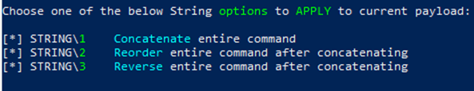

# Kape

## Scenario:

Given a Kape forensics capture can you solve these questions?

### Question 1: What is the Hostname of this machine?

After getting the file the first thing, we need to do in to extract it with 7zip or WinRAR.

.png>)

Once the File is extracted on a windows system we can right click and mount the drive to browse the contents.

.png>)

.png>)

In this drive we have the M folder which contains basically the C drive of a windows pc. The excel files are created from the KAPE tool and the long file names contains a list of files that are over a certain number of characters (most likely 256).

#### Event Logs:

Let’s start off by jumping into the Event logs in the following location: E:\M\Windows\system32\winevt\logs

Open up the System logs to get the first flag.

.png>)

.png>)

### Question 2: What is the name of the third account?

There are three local administrators on this system: Administrator, Assessor and our question.

For this one go back to File Explorer and go to the following location: E:\M\users

.png>)

### Question 3: Silver Smurfer Accessed a suspicious website, what was the URL?

For this next one we are going to look at the ntuser.dat file for Silver Smurfer, to do this we need a tool from Eric Zimmerman: [https://ericzimmerman.github.io/#!index.md](https://ericzimmerman.github.io/#!index.md)

I would grab the script to install the tools as we will need a few others for later questions.

For this one in particular we are going to run the RegistryExplorer

.png>)

.png>)

We will load the ntuser.dat file which is the HKUser hive for Silver Smurfer.                                                                                                                                      &#x20;

The registry key we are looking for is under ROOT\Software\Microsoft\Internet Explorer\TypedURLs

.png>)

We see that since they used Internet Explorer, we have their history and the answer to this question.

### Question 4: What was the name of the malicious process?

For this one we will go back to the event logs. For this we will use Zimmermans EvtxEmd.exe command.

This will read all the event logs and put it into a CSV file that will make it easier to parse the results.

From the folder of EvtxEcmd.exe run the following command: .\EvtxECmd.exe -d E:\M\Windows\system32\winevt\logs\ --csv c:\temp\zimmerman

This will read all the log files from the drive and output to c:\temp\zimmerman\\\<date>\_EvtxECmd\_Output.csv

.png>)

From here click on a cell and do Control + A to select all and go to insert Table with headers. This will make filter take no time at all.

First Filter Channel -> deselect all and select only Security

Next Filter EventID -> deselect all and select 4688 or New Process Creation

Next we will go to Column V: ExecutableInfo Click on V to highlight the whole column -> Insert -> Pivot Table -> Dump the column into a new sheet. This will give us a unique list of all processes started.

.png>)

We look at Silver Smurfer we can see that there is an odd looking lssas.exe file launched from there.

### Question 5: What is the full path the lssas.exe's parent process?

For this one we will go back to the main sheet in our event log dump.

We will filter out the Column V for lssas.exe executable that we found and the answer jumps out.

.png>)

### Question 6: What two processes were launched by cmd.exe immediately before lssas.exe?

For this remove the filter for lssas.exe from question 5. Do a search for lssas and look at the events surrounding the search.

.png>)

find.exe and tasklist.exe

### Question 7: What is the full path to the grandparent process?

For this we will do the same as question 6, only we will look for the next instance of cmd.exe in the executable info (not the parent process).

.png>)

C:\Windows\System32\svchost.exe

### Question 8: What is the name of the scheduled task lssas.exe is using for persistence?

For this question we will go back to the M drive and go to the Tasks Folder: E:\M\Windows\system32\Tasks

Here we see a task called SystemCheck that we need to look at.

.png>)

Open this up in Notepad:

.png>)

We see that this is calling a bat file. There is a repetition check enabled so this is persistence.

### Question 9: What is the name of the network share hosted on this workstation?

For this question we will be using Zimmerman’s MFTExplorer program to look at the MFT table located: E:\M

Load the $MFT table on the M drive.

.png>)

Since we know that Silver Smurfer is the user we want to focus on from all the previous questions, and we have a bat file coming from their appdata folder, let’s start our search there.

.png>)

Compared to the appdata folder on the M drive

.png>)

We see that there is a sneaky folder in there.

### Question 10: What is the full path to the sneaky share folder?

Sticking with question 9 we can say that the following is the path

C:\users\Silver Smurfer\AppData\sneaky

### Question 11: On what day was the sneaky directory created?

We look on the bottom right corner to of the MFTExplorer to find this info.

.png>)

### Question 12: What is the full path to the system utility someone used to examine FireFoxAnalyzer.exe?

For this we will move to another Zimmerman tool PECmd.exe.

Run this command to dump the contents to a csv in the c:\temp location

.\PECmd.exe -d e:\M --csv c:\temp\prefetch

.png>)

Open the Output CSV and put it into a table: Control + A -> Insert -> Table

Next we will search on Firefox and see what accessed the file.

We have two items that opened the file, Certutil.exe and firfoxanalyzer.exe

.png>)

This file is located at: \VOLUME{01d5be0528ae8f8c-1628d43c}\WINDOWS\SYSTEM32\CERTUTIL.EXE

## EZ Tools

A more in-depth look into the EZ tools used here will be in the future.

#### Registery Explorer

#### Prefetch Parser

#### Evtx Parser

#### MFT Parser
